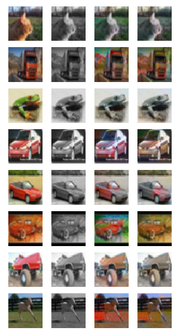

# Image colorization with GANs

The aim of this project is to explore the topic of image colorization with the help of Generative Adversarial Networks.


### Approach
The project heavily builds on the findings of the paper [Image Colorization with Generative Adversarial Networks by Nazeri et al](https://arxiv.org/abs/1803.05400). Similarly to the article, I studied image colorization on the [CIFAR10 dataset](https://www.cs.toronto.edu/~kriz/cifar.html) using adversarial learning. Additionally, I experimented with [spectral normalization](https://arxiv.org/pdf/1802.05957.pdf) in order to stabilize the training of the discriminator and reduce the instability of the whole training procedure.

### Prerequisites
 - numpy
 - torch (only tested with 1.0.0)
 - opencv-python

### Running the code
Training using regular batch normalization:
```sh
python3 train.py --max_epoch=200 --smoothing=0.9 --l1_weight=0.99 --base_lr_gen=3e-4 \
--base_lr_disc=6e-5 --lr_decay_steps=6e4 --disc_norm=batch --apply_weight_init=1
```
Training using spectral normalization:
```sh
python3 train.py --max_epoch=100 --smoothing=1.0 --l1_weight=0.985 --base_lr_gen=2e-4 \
--base_lr_disc=2e-4 --lr_decay_steps=4e4 --disc_norm=spectral --apply_weight_init=0
```
During training, a sample of images is saved after every epoch.

To go through to CIFAR10 test set and display/save some re-colorized images:
```sh
python3 test.py
```

### Results
Utilizing batch normalization in both networks resulted in vivid, colorful images. This is often an advantage when the sample images contain cars, trucks, or other objects with sharper colors. On the other hand, it can lead to over-colorization on blander images.

As expected, using spectral normalization in the discriminator network stabilized the training process and reduced the number of required training steps. The results show that this approach produces better and more believable colors. However, when the input grayscale image contains an object with a number of possible colors (for example cars), the generator network often produces grayish outputs. 

#### Qualitative evaluation
(left to right: original RGB, grayscale input, the output of the generator from the batch norm training, the output of the generator from the spectral norm training)

#### Some test examples where spectral normalization is superior:


#### Some test examples where batch normalization produces better results:


It is important to note that as a result of the adversarial loss function, approximating the original colors of the images is not the only goal of the generators. They also have to fill the images with realistic/believable colors in order to fool the discriminators (although, these tasks can be equivalent). In this regard, the models perform quite well, often creating colorful and lifelike samples.

#### Test samples where both generators struggle:


### Acknowledgements
 1. Most of the work is based on [the aforementioned paper](https://arxiv.org/abs/1803.05400) and the corresponding [github repo](https://github.com/ImagingLab/Colorizing-with-GANs).
 2. The excellent [PyTorch-GAN repository](https://github.com/eriklindernoren/PyTorch-GAN) served as a great guideline for the training implementation.
 3. Spectral normalization comes from [the article of Miyato et al](https://arxiv.org/pdf/1802.05957.pdf).
 4. The spectral norm PyTorch implementation is from [Christian Cosgrove's repo](https://github.com/christiancosgrove/pytorch-spectral-normalization-gan).
