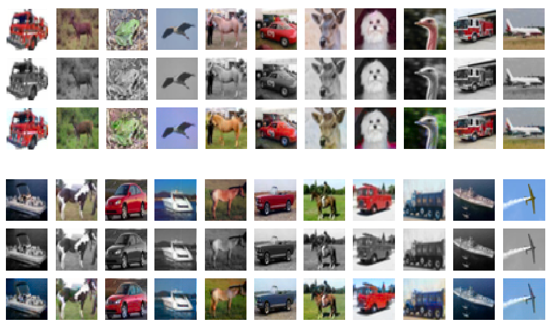
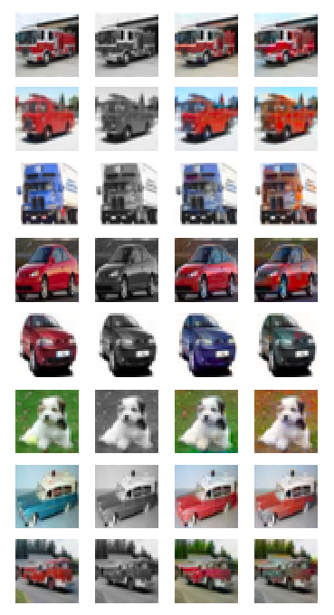

# Image colorization with GANs

The aim of this project is to explore the topic of image colorization with the help of Generative Adversarial Networks.


### Approach
The project heavily builds on the findings of the paper [Image Colorization with Generative Adversarial Networks by Nazeri et al.](https://arxiv.org/abs/1803.05400). Similarly to the article, I studied image colorization on the [CIFAR10 dataset](https://www.cs.toronto.edu/~kriz/cifar.html) with the help of adversarial learning. The generator network is based on a UNet, and the discriminator matches the generator's contractive path.

### Prerequisites
 - numpy
 - torch (only tested with 1.0.0)
 - opencv-python

### Running the code
To run the training code:
```sh
python3 train.py
```
During training, a sample of images is saved after every epoch.

To go through to CIFAR10 test set and display/save some re-colorized images:
```sh
python3 test.py
```
### Qualitative evaluation
(top to bottom: original RGB, grayscale input, generated)
#### Some good-looking samples:


It is important to note that as a result of adversarial loss function, approximating the original colors of the images is not the only goal of the generator. It also has to fill the images with realistic/believable colors in order to fool the discriminator (although, these tasks can be equivalent). In this regard, the model performs quite well, often creating colorful and lifelike samples.

#### Some bad-looking ones:


Evidently, the generator sometimes fails to identify a region or an object on an image, and it assigns unusual colors (at least to our eyes) to these parts. It also has a tendency to create sepia-like or grayish images.


### Acknowledgements
 1. [The aforementioned paper](https://arxiv.org/abs/1803.05400), and the corresponding [github repo](https://github.com/ImagingLab/Colorizing-with-GANs).
 2. The excellent [PyTorch-GAN repository](https://github.com/eriklindernoren/PyTorch-GAN).
 3. The spectral norm implenetation is copy-pasted from [Christian Cosgrove's repo](https://github.com/christiancosgrove/pytorch-spectral-normalization-gan).
